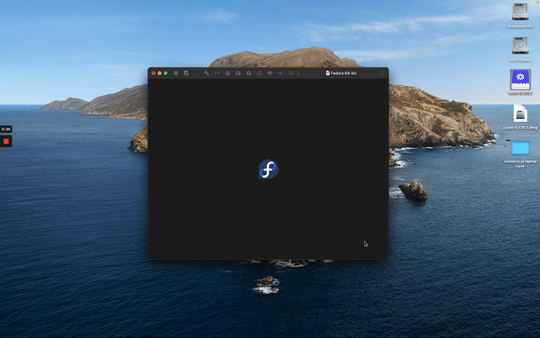

# Setting up a PERN stack web server on Fedora

# (1) Install needed softwares

## PostgreSQL
$ sudo dnf install postgresql postgresql-server

## Nodejs
$ sudo dnf install nodejs

## React
$ sudo npm install -g create-react-app

# Set programs to start on machine boot

## Set postgresql to start upon boot as this will be needed to run the website
$ sudo systemctl enable postgresql

## Create a web application directory this directory will hold the code and the express files needed for the web application
$ mkdir finalProject

## Change directory’s into the one you just created
$ cd finalProject

## Initialize a json file
$ npm init

## Install express while the current working directory is the directory you make for he web application to run the website
$ sudo npm install express - save

## create a index file to start from this is where the JavaScript for you web application will live
$ vim index.js
Enter in the JS for your web application here

## create a crontab that runs on startup that will start your webserver
$ crontab -e

## enter the following into the crontab editior
$ @reboot pulseaudio -k && pulseaudio 
$ @reboot redshift -c ~/.config/redshift/config.conf
$ @reboot npm /home/tucker/tucker/index.js

